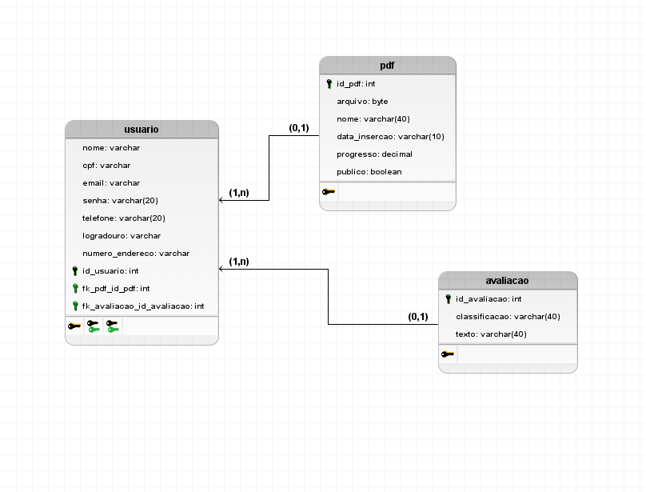

# Funcionalidades do Projeto  

1. Criar conta com os seguintes dados: nome, email e senha.
2. Logar na conta com o email e senha.
3. Deletar a conta, será necessario solicitar com a senha.  
4. Sistema de assinatura será incluido ápos inserir um cartão credito.
5. Salvar dados na nuvem irá guardar os livros e suas leituras.
6. Ler o PDF

# Entidades
- tb_usuario
- tb_pdf
- tb_avaliacao

# Nome  dos Integrantes Turma D

1. Israel Bernardo 
2. Philippe Kaway
3. Matheus Monteiro
4. Guilherme Braga
5. Lucas dos Santos Souza

## Protótipo

 

LINK DO FIGMA:
https://www.figma.com/embed?embed_host=share&url=https%3A%2F%2Fwww.figma.com%2Ffile%2FWiqAjwm40VFj6T3suK9YAK%2FREADER%3Fnode-id%3D0%253A1%26t%3DIQKhXkAviADEr84D-1

 

## Mer

